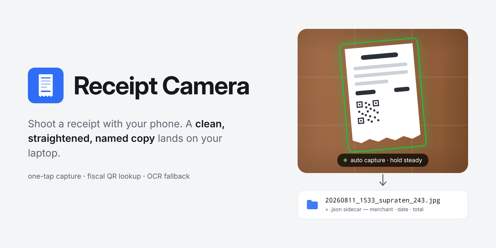

# Receipt Camera

Point your phone at a receipt, take the picture with the phone's own camera
app, and the photo lands in a folder on your laptop — with a clean,
straightened, named copy next to it. No app store — the "app" is a web page
served by your laptop, added to the phone's home screen.

## Start

    bin/configure
    bin/build
    cd ~/Documents/receipts
    /path/to/receipt-camera/bin/run

`bin/run` starts the http server and the receipt parser in the current
directory; Ctrl-C stops both. The startup log prints the URL(s) to open on the
phone.

## Docs

- [Server](docs/server.md) — ports, folders, running pieces separately
- [Phone](docs/phone.md) — one-time setup and daily use
- [Android app](docs/android.md) — one-tap capture, updates, keystore
- [Troubleshooting](docs/troubleshooting.md)
